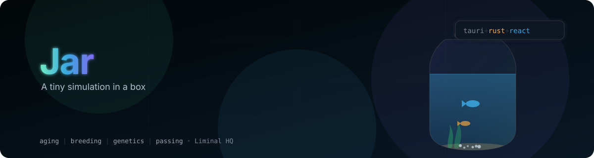

# Jar

<p align="center">
  
</p>

A tiny simulation in a box. A floating desktop aquarium/terrarium with a few auto-named critters who live, sleep, breed, age and pass on in real time. Windows 98 novelty-desktop-pet energy, with a nicer interface and flat vector art — a toy you glance at, not a game you win.

> **Status:** the aquarium/fish path is a working vertical slice — a native Rust simulation core, a background tick loop that keeps running while the window is hidden, a real-time R3F tank, and all four windows (Tank, Setup, Critter card, Family tree). Theming, tests, and CI are landing as an active pull request stack. Terrarium/gecko mode is a planned future extension, not yet started.

## What's in the jar

- Critters live, sleep, breed, age and pass on, one real second per sim tick, entirely on their own.
- Real genetics: hue inherited as parents' mean ± mutation, tail shape and spots inherited, sex rolled independently at birth.
- A family tree — every critter that's ever lived in the jar, memorialized after passing.
- Six tank frames (Bevelled 98, Wood stand, Brushed metal, Rounded glass, Neon/CRT, Cardboard cutout) crossed with six dialog themes (Modern, Modern dark, Classic 98, Paper notebook, Handheld LCD, Neon terminal).
- The simulation keeps ticking while the tank window is hidden or minimized — a jar left running ages and breeds exactly as much as one you're watching.

## Design

The product design and behaviour were originally specified in a [Claude Design](https://claude.ai/design) prototype, kept for historical reference in [`docs/ui-mockups/`](docs/ui-mockups/) — that's a design concept, not a current screenshot of this app.

## Architecture

Bun workspace monorepo + Cargo workspace:

| Path                       | What it is                                                                                         |
| -------------------------- | -------------------------------------------------------------------------------------------------- |
| `apps/jar`                 | The Tauri app: React/R3F frontend in `src/`, Rust shell in `src-tauri/`                            |
| `crates/jar-core`          | Pure Rust simulation core — aging, mood/energy, breeding, genetics, passing, naming, the jar clock |
| `crates/jar-protocol`      | Shared types + wire format; `ts-rs` generates the TypeScript interfaces the frontend imports       |
| `plugins/tauri-plugin-jar` | The native adapter: background sim loop, event channel, autosave                                   |

The split is one sentence: if a value changes at most once a second to be a fact about a critter (age, mood, breeding, passing), it lives in the Rust core; if it changes every frame to look alive (position, velocity, animation pose), it lives in JS.

Read [`SPEC.md`](SPEC.md) and [`SCREENS.md`](SCREENS.md) for product behaviour, [`docs/architecture/3d-engine.md`](docs/architecture/3d-engine.md) for the rendering/physics/AI stack, and [`docs/architecture/rust-core.md`](docs/architecture/rust-core.md) for the Rust simulation core. [`AGENTS.md`](AGENTS.md) and [`CLAUDE.md`](CLAUDE.md) cover contributor conventions. **Picking this up to implement it? Start with [`NEXT_STEPS.md`](NEXT_STEPS.md)** — it says exactly what's real vs. stubbed and where to begin.

## Getting started

```bash
bun install
bun run tauri dev
```

Run `bun run validate` before opening a PR — it's the same gate CI runs (format check, frontend tests, build, `cargo fmt`/`clippy`, Rust tests).

Licensed under either of [Apache License, Version 2.0](LICENSE-APACHE) or [MIT license](LICENSE-MIT) at your option.
